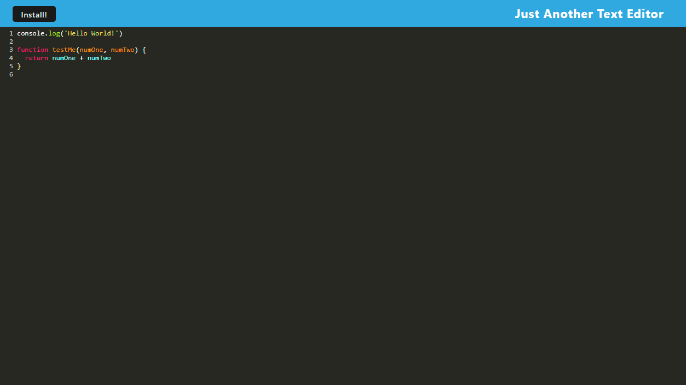
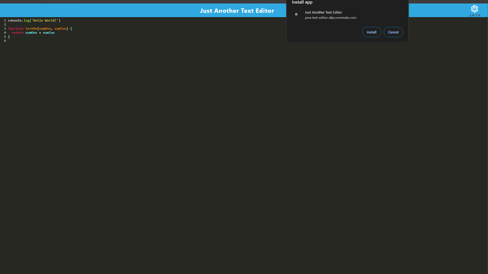
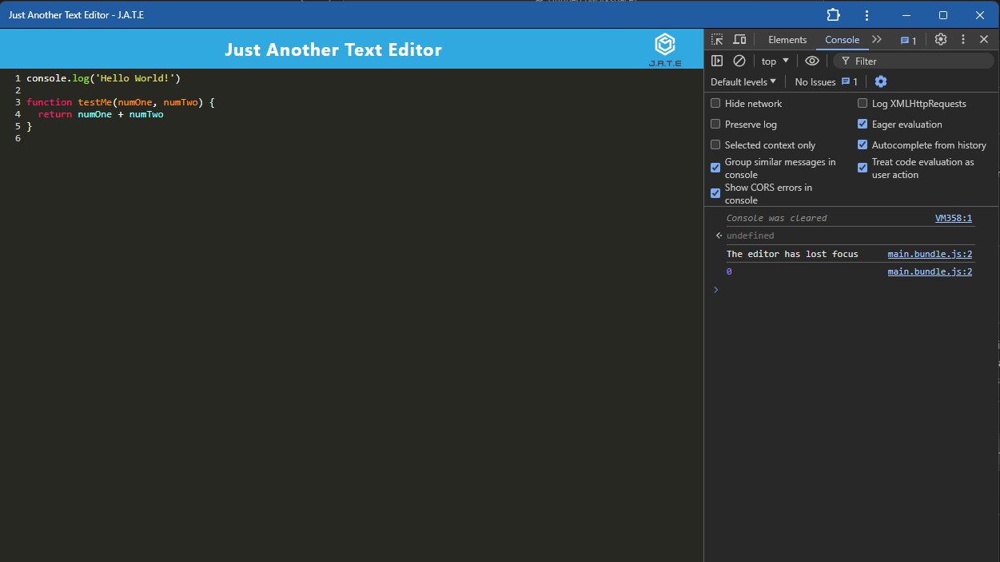

# pwa-text-editor

## Description

This is a project for UW Bootcamp in which we were asked to take a partially completed text editor, implement methods for getting and storing data to an IndexedDB database, and build a progressive web app that can be used offline as well. Webpack is used as the bundler for this app.

## Installation

This application can be run locally by pulling the contents of this repo. Navigate to the main directory and type `npm run install` in the terminal, then `npm run start`. The app has also been deployed on Render: https://pwa-text-editor-afpo.onrender.com/.

## Usage

Once the app is open in the browser, it can be used as a text editor that will save and recall whatever is typed. The app can be installed to the desktop and run offline by clicking the 'Install!' button in the top left corner.  

Link to deployed application: https://pwa-text-editor-afpo.onrender.com/

Text editor showing color styling for JS

Pop-up confirming local install

PWA being run offline

## License

N/A

## Questions

Any questions about this application should be directed to:

GitHub: https://github.com/ktunebe

Email: ktunebe@gmail.com

